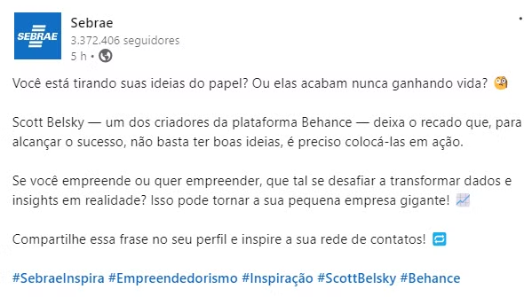

# 2024

---

# Para inspirar

## Ganchos

- **Remix**
    
    
    [https://www.instagram.com/reel/C9ffSCOxbpi/?igsh=MWIzbzg1Mzc0bTc0dg==](https://www.instagram.com/reel/C9ffSCOxbpi/?igsh=MWIzbzg1Mzc0bTc0dg==)
    
    [https://www.instagram.com/reel/C9vZ4jqCxRD/?igsh=MTQycTZ2a3hxdmdrNA==](https://www.instagram.com/reel/C9vZ4jqCxRD/?igsh=MTQycTZ2a3hxdmdrNA==)
    
    [https://www.instagram.com/reel/C_K1LROMJ5d/?igsh=MWh1Y3Y3NnhoZ2d4aA==](https://www.instagram.com/reel/C_K1LROMJ5d/?igsh=MWh1Y3Y3NnhoZ2d4aA==)
    
    [https://www.instagram.com/reel/DAV76bAO2PG/?igsh=MTkxbng4enpiN2ltNw==](https://www.instagram.com/reel/DAV76bAO2PG/?igsh=MTkxbng4enpiN2ltNw==)
    
    [https://www.instagram.com/reel/CyyecwhREt_/?igsh=MTEwajgwN2ZkbjF2YQ==](https://www.instagram.com/reel/CyyecwhREt_/?igsh=MTEwajgwN2ZkbjF2YQ==)
    
- **Soul Connected Insight**
    
    
    [Como a Gestão Contábil Estratégica Pode Impulsionar o Crescimento da Sua Empresa](https://www.linkedin.com/pulse/como-gestão-contábil-estratégica-pode-impulsionar-tl1bf/?trackingId=d3nDi7oFTWKD776ZvD03ig==)
    
    [Crescendo Rápido Demais? Por que Aumentar Vendas Pode Afundar Seu Negócio!](https://www.linkedin.com/pulse/crescendo-rápido-demais-por-que-aumentar-vendas-mm6xf/?trackingId=V6IByEzSS0e+Z5upik0wrA==)
    
    [O endividamento está impedindo sua empresa de alcançar o pleno potencial de crescimento?](https://www.linkedin.com/pulse/o-endividamento-está-impedindo-sua-empresa-de-alcançar-7ngtf/?trackingId=1FR5YvAeQBulMHH5HvH2bg==)
    
    [Fusões e Aquisições no Brasil: Oportunidade ou Armadilha?](https://www.linkedin.com/pulse/fusões-e-aquisições-brasil-oportunidade-ou-armadilha-dm8of/?trackingId=rv6KbfLwTvu/u0+r5MBeGg==)
    
- **Juliana**
    
    [Juliana Brancaglioni Casciatori on LinkedIn: #osp #contacmg #contabilidade #industria #multinacional #lucroreal…](https://www.linkedin.com/posts/juliana-brancaglioni-casciatori_osp-contacmg-contabilidade-activity-7245406879839862785-DmkZ?utm_source=share&utm_medium=member_desktop)
    
- **Deloitte**
    
    
    [Deloitte on LinkedIn: As transformações impulsionadas pelo Pillar Two, por meio da regra GloBE…](https://www.linkedin.com/posts/deloitte_as-transformações-impulsionadas-pelo-pillar-activity-7239357410526556161-LGEb?utm_source=share&utm_medium=member_desktop)
    
    [Deloitte on LinkedIn: Novas regulamentações são uma oportunidade para a indústria de seguros se…](https://www.linkedin.com/posts/deloitte_novas-regulamentações-são-uma-oportunidade-activity-7245160249215574017-eh8y?utm_source=share&utm_medium=member_desktop)
    
- **EY**
    
    
    [EY on LinkedIn: #ceo #betterworkingworld | 24 comments](https://www.linkedin.com/posts/ernstandyoung_ceo-betterworkingworld-activity-7239190025274368000-e-55?utm_source=share&utm_medium=member_desktop)
    
    [EY on LinkedIn: EY-dagen 2024 - Webbinarier | 31 comments](https://www.linkedin.com/posts/ernstandyoung_ey-dagen-2024-webbinarier-ugcPost-7246774637362036736-swTg?utm_source=share&utm_medium=member_desktop)
    
    [EY on LinkedIn: #worldentrepreneurday #entrepreneurship | 28 comments](https://www.linkedin.com/posts/ernstandyoung_worldentrepreneurday-entrepreneurship-activity-7231943290403639296-frVY?utm_source=share&utm_medium=member_desktop)
    
    [https://www.linkedin.com/posts/ernstandyoung_empreendedor-do-ano-homenageados-da-26ª-activity-7241530254962438146-F6Eg?utm_source=share&utm_medium=member_desktop](https://www.linkedin.com/posts/ernstandyoung_empreendedor-do-ano-homenageados-da-26ª-activity-7241530254962438146-F6Eg?utm_source=share&utm_medium=member_desktop)
    
- **Forbes**
    
    [Forbes Brasil on LinkedIn: Ações do Assaí desabam; Ibovespa cai 3% em setembro e mais notícias do…](https://www.linkedin.com/posts/forbes-brasil_forbesmoney-mercadofinanceiro-activity-7246658804468043776-Cbdq?utm_source=share&utm_medium=member_desktop)
    
- **Tributação**
    
    
    [Kelly Marques on LinkedIn: Qual a relação entre as formas jurídicas de tributação e o regime…](https://www.linkedin.com/posts/kelly-marques-b446722b_empreendedorismo-formajuraeddica-regimetributaerrio-activity-7244022303800344579-yboR?utm_source=share&utm_medium=member_desktop)
    
    [Mônica Rocha on LinkedIn: Tributação de Bebidas: Conheça os Impostos que Incidem sobre o Setor](https://www.linkedin.com/posts/mônicarocha_tributaaexaeto-impostos-icms-activity-7243952282831077376-k58B?utm_source=share&utm_medium=member_desktop)
    
- **Imagens**
    
    
    [https://www.instagram.com/reel/C_gC3ahpjAh/?igsh=Z3huMHM0OTNubTJv](https://www.instagram.com/reel/C_gC3ahpjAh/?igsh=Z3huMHM0OTNubTJv)
    
    [https://www.instagram.com/reel/C99EzrjtvPn/?igsh=MWVwZG5idjZqaWpycQ==](https://www.instagram.com/reel/C99EzrjtvPn/?igsh=MWVwZG5idjZqaWpycQ==)
    
- **Banco do Brasil**
    
    [https://www.linkedin.com/posts/bbasset_a-bb-asset-tá-na-bolsa-activity-7246937944014381056-t7Z1?utm_source=share&utm_medium=member_desktop](https://www.linkedin.com/posts/bbasset_a-bb-asset-tá-na-bolsa-activity-7246937944014381056-t7Z1?utm_source=share&utm_medium=member_desktop)
    

## Redes Sociais

## 🗃️ Contasy

Posts informativos com carrossel

https://www.instagram.com/contasy/

[https://www.instagram.com/p/C_0gCAoOKhy/?img_index=5](https://www.instagram.com/p/C_0gCAoOKhy/?img_index=5)

## 🎥 Ideias de captação e edição

### Como gravar e enquadrar o video para reels

[https://www.instagram.com/reel/C_s7T5yO70j/?igsh=djNoazhmZ3lvN21x](https://www.instagram.com/reel/C_s7T5yO70j/?igsh=djNoazhmZ3lvN21x)

### Como fazer ganchos de video

- Cada cena, um movimento diferente
- É importante ter esse tipo de gancho para que as pessoas possam parar e ver o video por alguns segundos

[https://www.instagram.com/reel/C9-ih1MREEk/?igsh=M3YxcWRqMWN0M3hl](https://www.instagram.com/reel/C9-ih1MREEk/?igsh=M3YxcWRqMWN0M3hl)

### Formato cinema

- **Formato de publicação com diálogo**
- **Substitui o carrossel tradicional do feed**

[https://www.instagram.com/reel/C9LmXNds-Eu/?utm_source=ig_web_copy_link](https://www.instagram.com/reel/C9LmXNds-Eu/?utm_source=ig_web_copy_link)

## 🗃️ KPMG

### Vlog - Rotina da empresa

[https://www.instagram.com/reel/C-8ChAKO7A1/](https://www.instagram.com/reel/C-8ChAKO7A1/)

### Pílula - 01 Pergunta e 01 Resposta

[https://www.instagram.com/reel/C_A3uTDuDos/?utm_source=ig_web_copy_link&igsh=MzRlODBiNWFlZA==](https://www.instagram.com/reel/C_A3uTDuDos/?utm_source=ig_web_copy_link&igsh=MzRlODBiNWFlZA==)

### Endomarketing - Divulgando vagas de emprego

[https://www.instagram.com/reel/C-vZwvAhbIc/?utm_source=ig_web_copy_link&igsh=MzRlODBiNWFlZA==](https://www.instagram.com/reel/C-vZwvAhbIc/?utm_source=ig_web_copy_link&igsh=MzRlODBiNWFlZA==)

## 🗃️ EY

### Cobertura de Evento

[EY on LinkedIn: EY NextGen Women](https://www.linkedin.com/posts/ernstandyoung_ey-nextgen-women-activity-7239322144793350145-hfSH?utm_source=share&utm_medium=member_desktop)

### Pesquisas e dados interessantes

[EY on LinkedIn: EY Future Consumer Index | 54 comments](https://www.linkedin.com/posts/ernstandyoung_ey-future-consumer-index-activity-7233376352647671809-Zv42?utm_source=share&utm_medium=member_desktop)

[EY on LinkedIn: #worldentrepreneurday #entrepreneurship | 28 comments](https://www.linkedin.com/posts/ernstandyoung_worldentrepreneurday-entrepreneurship-activity-7231943290403639296-frVY?utm_source=share&utm_medium=member_desktop)

### Depoimentos

[EY on LinkedIn: EY por você](https://www.linkedin.com/posts/ernstandyoung_ey-por-você-activity-7232486976237576192-psll?utm_source=share&utm_medium=member_desktop)

## 🗃️ PwC

### Pesquisas e dados interessantes

- **Dados interessantes de pesquisas**
- **Importante ter a ver com indústrias, multinacionais e lucro real**

[https://www.instagram.com/p/C92bYUDC-bt/](https://www.instagram.com/p/C92bYUDC-bt/)

### Cobertura de eventos

[https://www.instagram.com/p/C8vBeZexQYn/?img_index=1](https://www.instagram.com/p/C8vBeZexQYn/?img_index=1)

### Endomarketing - Como é trabalhar na empresa

[https://www.instagram.com/reel/C4YMAvTiMvO/?utm_source=ig_web_copy_link&igsh=MzRlODBiNWFlZA==](https://www.instagram.com/reel/C4YMAvTiMvO/?utm_source=ig_web_copy_link&igsh=MzRlODBiNWFlZA==)

## 🗃️ A "nova” Contabilidade x Contadores de Escritório

- **Aborda o papel do contador para além da burocracia**
- **Falar sobre a importância de entender o negócio do cliente e saber analisar os números**

[Glenio Alexis on LinkedIn: DEIXANDO O CONTABILEZ DE LADO! 🎯   Entender do negócio é crucial para… | 17 comments](https://www.linkedin.com/posts/glenioalexis_deixando-o-contabilez-de-lado-entender-activity-7232164418841673728-jaGi?utm_source=share&utm_medium=member_desktop)

## 🗃️Sebrae

### Cases de sucesso dinâmico

- **Case de sucesso pelo uso dos produtos**
- **Gravação e edição dinâmica, texto curto de 30s**
- **Narração (Loc Off)**
- **O video pode ser feito com atores (colaboradores da OSP?)**
- **Os cases podem ser reais e falar o nome dos clientes ou se basearem no caso concreto e utilizar nomes fictícios**

[https://www.linkedin.com/posts/sebrae_movemais-sebrae-empreendedorismo-activity-7240060874470658048-3XSN?utm_source=share&utm_medium=member_desktop](https://www.linkedin.com/posts/sebrae_movemais-sebrae-empreendedorismo-activity-7240060874470658048-3XSN?utm_source=share&utm_medium=member_desktop)

### Diferenciação dos Produtos

- **Diferenciação dos produtos**
- **Diferenciação dos problemas/questões**

### Apresentação de Produtos

- **Apresentação dos produtos**
- **Pessoa + gravação de tela**
- **Posicionamento**
- **Vínculo com a associação Influência Positiva**

[https://www.linkedin.com/posts/sebrae_sebrae-empreendedorismo-sebraegeral-activity-7240099713008447488-JBGE?utm_source=share&utm_medium=member_desktop](https://www.linkedin.com/posts/sebrae_sebrae-empreendedorismo-sebraegeral-activity-7240099713008447488-JBGE?utm_source=share&utm_medium=member_desktop)

### Datas e sazonalidade

- **Falar sobre datas marcantes e campanhas de saozinalidade**
- **Evitar usar em excesso, poucos posts por ano**
- **Ex: ano novo, dia do contador, mudança de exercício, algum evento contábil específico de indústria**

### Frase escrita a mão

- **Apresentação de uma ideia, um bordão, um valor que o ICP tenha**
- **Inspiração ao público, escrito à mão traz humanidade**
- **Bordões da OSP e explicação**

## 🗃️ Eihero

- **Apresentação de um produto**
- **Vídeo curto com explicação simples**
- **Apresentado por gestor ou sócio**

[https://www.linkedin.com/posts/eiheroglobal_eihero-importaaexaeto-exportaaexaeto-activity-7240358567172575232-j0pX?utm_source=share&utm_medium=member_desktop](https://www.linkedin.com/posts/eiheroglobal_eihero-importaaexaeto-exportaaexaeto-activity-7240358567172575232-j0pX?utm_source=share&utm_medium=member_desktop)

## 🗃️ Republica

## 🗃️ **My Xcell Network Corp**

[https://www.linkedin.com/posts/republica-455_republica-strategy-digital-activity-7240387484583395328-Oh5G?utm_source=share&utm_medium=member_desktop](https://www.linkedin.com/posts/republica-455_republica-strategy-digital-activity-7240387484583395328-Oh5G?utm_source=share&utm_medium=member_desktop)

- **Apresentação do site novo**
- **Edição dinâmica**
- **Apresentação simplificada das abas dos sites**

[https://www.linkedin.com/posts/myxcellnetwork_assistsyourbiz-globaleconomy-businessgrowth-activity-7240381955370819584--Po_?utm_source=share&utm_medium=member_desktop](https://www.linkedin.com/posts/myxcellnetwork_assistsyourbiz-globaleconomy-businessgrowth-activity-7240381955370819584--Po_?utm_source=share&utm_medium=member_desktop)

- **Abordagem de situação/problema (exemplos)**
- **Apresentação do produto como resolução do problema**
- **Exemplos visuais**

## 🗃️ **M2 Cloud & Security**

- **Analogias vinculadas a algum evento específico**
- **Analogia sobre um produto x uma situação/problema**

## 🗃️ Contabilizei

### Contraste

- **Trabalhar ideias de contraste**
- **Estilo antes e depois, mas que façam sentido com o ICP**

[https://www.instagram.com/reel/C_s7T5yO70j/?utm_source=ig_web_copy_link](https://www.instagram.com/reel/C_s7T5yO70j/?utm_source=ig_web_copy_link)

- **Dicas de captação e edição**
- **Posicionamento de rosto, legenda e elementos**

### Perguntas típicas do ICP

- **Post para tirar dúvidas com perguntas específicas que fazem sentido para o ICP**
- **Estimula interação**

## 🗃️Santander

- **Roteiro pensado na explicação do passo a passo**
- **Como funciona o processo na OSP**
- **Após a primeira reunião, o que acontece? O que devo fazer?**
- **Elementos gráficos + ICPs**

[https://www.youtube.com/watch?v=3VHLQPX7NT0](https://www.youtube.com/watch?v=3VHLQPX7NT0)

- **Simulação do sistema da OSP**
- **Explicação do passo a passo**
- **Elementos visuais e dinâmicos**

[https://www.youtube.com/watch?v=6Ts3onwAhSk](https://www.youtube.com/watch?v=6Ts3onwAhSk)

## 🗃️Itaú

- **Simulação do passo a passo processo OSP sem revelar o sistema**
- **Elementos visuais simples e explicação didática**

[https://www.youtube.com/watch?v=q1L_YsdTgKo](https://www.youtube.com/watch?v=q1L_YsdTgKo)

## 🗃️Claro

- **Demo do sistema**
- **Mostrar como funciona a plataforma**
- **O que é a estratégia utilizada pela OSP**
- **Como funciona o processo após a primeira reunião**
- **Elementos visuais gráficos como complemento da explicação**

[https://www.youtube.com/watch?v=mJKiU2Xr3rg](https://www.youtube.com/watch?v=mJKiU2Xr3rg)

## 🗃️Monday

- **Mostrar como funciona a plataforma**
- **Como funciona o processo após a primeira reunião**
- **Simular gravação da tela**
- **Elementos visuais gráficos como complemento da explicação**

[https://www.youtube.com/watch?v=VoxVe69EqDs](https://www.youtube.com/watch?v=VoxVe69EqDs)

# Para evitar

- Copiar concorrentes locais
- Ter feed com muitas imagens e poucos reels
- Ficar muito corporativo nas redes sociais, pois é preciso adaptar o tom para cada canal
- Evitar fotos de template de Canva e Photoshop, dar preferência para conteúdo em video
- Postar só por postar sem nenhuma relação ao aplicação prática com a empresa e os ICPs